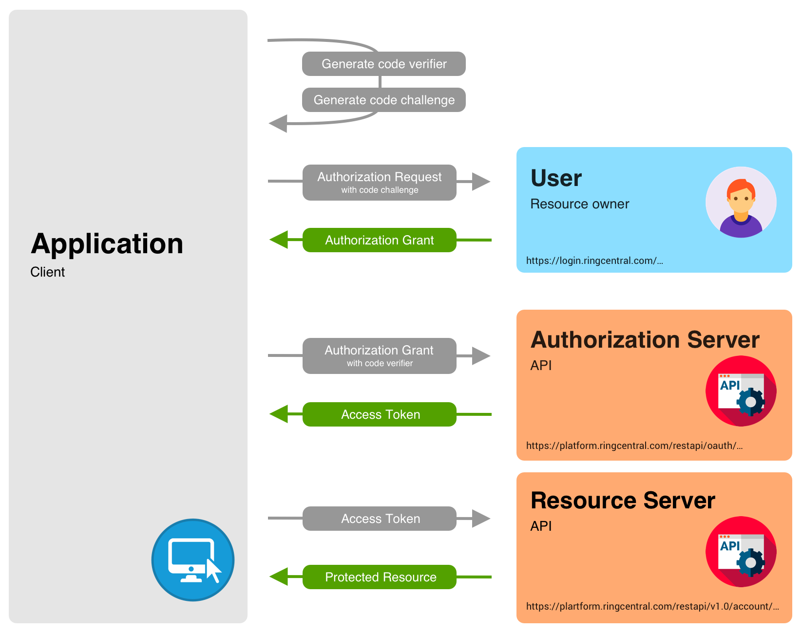

# Authorization code flow with Proof Key for Code Exchange

The Authorization code flow with Proof Key for Code Exchange, or simply "Auth code flow with PKCE" is the recommended form of authenticating RingCentral users and exchanging tokens in client-side applications. It is considered a more secure version of the more widely used [Authorization code flow](auth-code-flow.md). The flow is as follows:

{class=".img-fluid" style="max-width: 600px"}}

### What are the benefits of using the authorization code flow?

As you can see from the diagram above, the two protocols are nearly identical, with the following differences and benefits:

* two additional tokens are introduced to the flow to combat XSS forgeries
* the client secret is never revealed during the flow

## Authorization code flow with PKCE in detail

### Step 0. Generate code verifier and code challenge

Before we initiate an authorization request to RingCentral, we need to generate two strings: a code verifier and a code challenge. The code verifier, in particular, should be a cryptographically random string without the '+', '/', and '=' characters. 

The code challenge is then derived from the code verifier string generated above. For devices that can perform a SHA256 hash, the code challenge is a Base64, URL-encoded string of the SHA-256 hash of the code verifier. Clients that do not have the ability to perform a SHA-256 hash are permitted to use the plain code verifier string as the challenge.

The code below shows how to generate these two strings:

=== "Javascript"

    Javascript developers can install the `crypto` module like so:
	
    ```bash
    $ npm install crypto
    ```
	
    Then your code will look like this:
    
    ```javascript
    {!> code-samples/auth/login-url-pkce.js [ln:2-22] !} 	
    ```

=== "Python" 

    Python developers can install the `pkce` module like so:
	
	```bash
	$ pip install pkce
	```
	
	Then in their code it is really simple:
    
	```python
    {!> code-samples/auth/pkce.py !} 	
	```

=== "PHP"

    ```php
    {!> code-samples/auth/pkce.php !} 	
    ```

=== "Ruby"

    Ruby developers can install the `pkce_challenge` Gem like so:
	
    ```bash
    $ gem install pkce_challenge
    ```
	
    Then in their code:
	
    ```ruby
    {!> code-samples/auth/pkce.rb !} 	
    ```

#### Example code verifier and challenge strings

When all is said and done, you will have generated two strings that look similar to the following:
A cryptographically-random example string:

```
# Verifier
pIUgx4tiqFpaOUz0HMc_QbIyQlL901w8mRmkrmhEJ_E

# Challenge
_drLS7o5FwkfUiBhlq2hwJnK_SC6yE7sKOde5O1fdzk
```

### Step 1. Compose a "request authorization" URL

When your application needs to access a user's data, redirect the user to the RingCentral API server. The authorization URL is the same as the URL from [Authorization Code Flow Step 1](auth-code-flow.md#step-1-request-authorization-code), and PKCE flow will need additional parameters `code_challenge` and `code_challenge_method` in the authorization URL:

{! docs/authentication/login-url-params.inc !} 
| `code_challenge` | string | Required. Generated from code challenge.
| `code_challenge_method` | string | Required. The code challenge method, either plain or S256, depends on whether the challenge is the plain verifier string or the SHA256 hash of the string. If this parameter is omitted, the server assumes plain.

#### Example Login URL

Below is an example login URL to initiate the PKCE authorization flow. We recommend developers use an SDK to generate this URL in a more automated fashion.

```
https://platform.ringcentral.com/restapi/oauth/authorize?response_type=code
   &redirect_uri=<my_uri>&client_id=<client_id>&display=&prompt=
   &code_challenge=<code_challenge_string>&code_challenge_method=S256
```

#### Using an SDK to generate a login URL

We recommend developers use an SDK to generate a login URL to ensure it is composed properly.

=== "Javascript" 

    ```javascript
    {!> code-samples/auth/login-url-pkce.js !} 
    ```

### Step 2. User login and consent

This step is same as its counterpart in the [authorization code flow](auth-code-flow.md#step-2-user-login-and-consent). After a user logs in and authorizes the application, RingCentral will redirect the user's browser to the `redirect_uri` provided in the login URL created above. At the same time, RingCentral will append the following query parameters to the redirect URI, which your application will need in subsequent steps. 

{! docs/authentication/auth-code-params.inc !} 
	
#### Example OAuth redirect
	
```http
HTTP/1.1 302 Found
Location: https://myapp.example.com/oauth2Callback?code=SplxlOBeZQQYbYS6WxSbIA&state=xyz&expires_in=60
```

### Step 3. Exchange auth code for access token

The 'code' your application receives at your Redirect URI is a temporary authorization code used to obtain an access token to call the API. If the token is not redeemed in the allotted time, the user will need to go through the login and authorization process again. This is the final step before your app can call the RingCentral API. 

To exchange an auth code for an access token, developers will call the RingCentral API similarly to how it is done in the authorization code flow, but with the following key differences:

* Clients do not need to transmit client authentication credentials in an `Authorization` header
* Clients need to transmit an additional `code_verifier` parameter in the request body

#### Auth token request

**HTTP Headers**

| Header           | Value                                                      |
| ---------------- | ---------------------------------------------------------- |
| `Content-type`   | `application/x-www-form-urlencoded`                        |

**POST Parameters**

{! docs/authentication/auth-token-params.inc !} 
| `code_verifier`         | string   | Required. Code verifier generated in Step 0. |

**Sample Request**

```http
POST /restapi/oauth/token HTTP/1.1 
Accept: application/json 
Content-Type: application/x-www-form-urlencoded 

code=U0pDMTFQMDFQQVMwM
  XxBQUJfTVpHWk5lM29zNVFmWnNHQ01MSmJuMHJmNGlRcnRaeEptTWlPS0MzUTdYRDdSTURiaHBuWHZINGM2WTdqaWlBOE
  VhRHNxRWdJVUNYQjd4dmJsWHJoVVlWQVN2SFo2YWJPanJsRkFWZk9SMm5lek0tWnF5d3h8C3AnYOPxO0flEwO6Ffoq9Tl
  qs1s&grant_type=authorization_code&client_id=asdsadsadasdadsa&code_verifier=pIUgx4tiqFpaOUz0H
  Mc_QbIyQlL901w8mRmkrmhEJ_E&redirect_uri=https%3A%2F%2Fmyapp.acme.com%2Foauth2redirect
```

#### Auth token response

The server responds with an access token which can presented in subsequent requests in the HTTP Authorization header to authenticate API Calls. The response will contain the following parameters: 

{! docs/authentication/auth-token-response.inc !} 

**Sample Response**

```http
HTTP/1.1 200 OK
Content-Type: application/json

{
    "access_token" : "U1BCMDFUMDRKV1MwMXxzLFSvXdw5PHMsVLEn_MrtcyxUsw",
    "token_type" : "bearer",
    "expires_in" : 7199,
    "refresh_token" : "U1BCMDFUMDRKV1MwMXxzLFL4ec6A0XMsUv9wLriecyxS_w",
    "refresh_token_expires_in" : 604799,
    "scope" : "AccountInfo CallLog ExtensionInfo Messages SMS",
    "owner_id" : "256440016"
}
```

