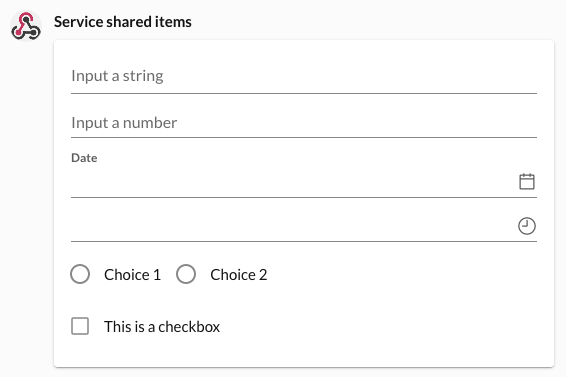

# Adaptive Card layout and design

<h2 class="h4 pb-2 lh-lg">The Adaptive Card framework provide a robust system for laying out content in a way that is adaptive, accessible and localizable.</h2>

One of the advantages of leveraging the Adaptive Card framework is the extensive tools and documentation available to developers to assist them in designing, and implementating adaptive cards in their application. What follows below is a high-level overview of the kinds of elements this framework provides to help developers unfamiliar with Adaptive Cards in understanding the core concepts. 

If you are already familiar with the core concepts behind Adaptive Cards, we recommend you consult the official [Adaptive Cards documentation](https://docs.microsoft.com/en-us/adaptive-cards/).

<div class="card mb-3">
  <div class="row g-0">
    <div class="col-md-8">
      
    </div>
    <div class="col-md-4">
      <div class="card-body">
        <h5 class="card-title">Adaptive Card Designer</h5>
        <p class="card-text">The Adaptive Card designer provides an easy-to-use, drag-and-drop interface for designing and building adaptive cards.</p>
        <p class="card-text"><a class="btn btn-primary" href="https://adaptivecards.io/designer/">Try it out</a></p>
      </div>
    </div>
  </div>
</div>

## Containers

Containers provide the basic building blocks for laying out text, images and forms. The basic container elements include:

* **Container**. A collection of related elements. 
* **ColumnSet** and **Column**. A way of laying out content from left to right.
* **FactSet**. A way of displaying a collection of name/value pairs.
* **ImageSet**. A way of displaying multiple images at once in a gallery format.

**Sample card with various containers**

```json
{!> code-samples/team-messaging/adaptive-cards/basic-columns.json !}
```

The above card when posted to RingCentral, will appear as shown below:


## Elements

Elements comprise the core content of a card. They are static and uneditable. They include these basics:

* **TextBlock**. A basic string of text. The entire string can styled in various ways, or portions of text can be styled using a simplified version of markdown.
* **RichTextBlock** and **TextRun**. A sequence of strings, each with their own style characteristics that are concatenated together.
* **Image**. An image referenced by a URL. 
* **Media**. A video, audio file or other form of media (not an image). 
* **ActionSet** and **Action**. A button that triggers an action or card behavior.  

**Sample rich text card**

```json
{!> code-samples/team-messaging/adaptive-cards/rich-text.json !}
```

The above card when posted to RingCentral, will appear as shown below:


### Actions

Actions, which are grouped under and `ActionSet`, create buttons which can trigger interactivity and other card behaviors. 

* **Action.OpenUrl**. Trigger a URL to be opened. 
* **Action.ShowCard**. Reveal a hidden card.
* **Action.Submit**. Submit a form containing input elements.
* **Action.ToggleVisbility**. Show/hide target containers, elements and/or inputs.

## Inputs

Input elements comprise all of the form elements that allow users to input data into a card, and then later submitted to underlying service via the `Action.Submit` action.

* **Input.Text**. A text field. 
* **Input.Date**. A date-picker.
* **Input.Time**. A time-picker.
* **Input.Number**. A text field with built-in validation for accepting numbers. 
* **Input.ChoiceSet**. A pull-down menu or a set of radio buttons.
* **Input.Toggle**. A checkbox or toggle. 

**Sample card with input elements**

```json
{!> code-samples/team-messaging/adaptive-cards/inputs.json !}
```

The above card when posted to RingCentral, will appear as shown below:



## Additional resources

There exists in the Adaptive Card developer community a great number of useful resources that provide much more comprehensive guidance on how they can be designed and laid out. 

* [Adaptive Cards Designer](https://adaptivecards.io/designer/)
* [Schema Explorer](https://adaptivecards.io/explorer/)
* [Samples and templates](https://adaptivecards.io/samples/)
* [Documentation](https://docs.microsoft.com/en-us/adaptive-cards/)
