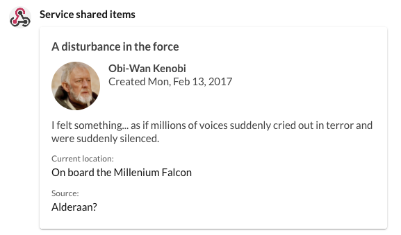

# Testing incoming webhooks using cURL

A simple way to test an incoming webhook and to make formatting messages easier is to use a simple command-line tool called cURL. Using this simple technique, you can place your message contents in a stand alone file, and then post that file to the URL of an incoming webhook.

Let's begin by creating the file `test.json` using the following contents:

```json
{!> code-samples/team-messaging/adaptive-cards/simple-card.json !}
```

Then from the same directory in which you created the above file, run the following command -- being sure to use the [webhook URL you created on your own](../webhook-creation/). 

```sh
% curl -d @test.json -H 'Content-Type: application/json' \
     https://hooks.ringcentral.com/webhook/v2/9e116c5c-xxxx-yyyy-zzzz-c12a85cd6063
```

When complete, you should see a message that looks something like this:



## Creating a script

The following sample script bootstraps the curl command above to make invoking the command a little easier and less verbose. 

```sh
{!> code-samples/team-messaging/adaptive-cards/test.sh !}
```

